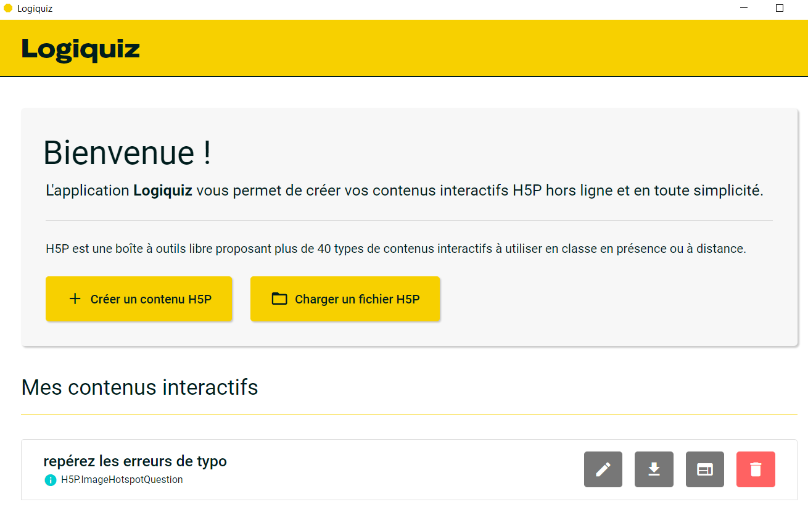

<!--

title: H5P et LiaScript, écrire des ressources éducatives libres

email: damien.belveze@univ-rennes1.fr 

language: fr 

@Jonas: French Male

comment: ce support a été présenté dans le cadre du Stretching Numérique (https://stretchingnumerique.fr) le 17 mars 2023

-->

# Stretching Numérique : H5P et Liascript

## Introduction au H5P 

              --{{1 @Jonas}}--
H5P (HTML-5 Package) est un logiciel libre basé sur HTML5 et JavaScript développé depuis 2014

On peut éditer des activités avec H5P au moyen d'éditeurs téléchargeables ou bien à partir de Moodle (si le plugin pour H5P a bien été implémenté par votre gestionnaire Moodle)

Dans le cadre de cet atelier, nous vous proposons d'utiliser l'éditeur **Logiquiz** publié par le collectif La Digitale [^1]

[lien de téléchargement de Logiquiz](https://ladigitale.dev/logiquiz/)

- télécharger le logiciel et l'ouvrir
- observer la palette des activités H5P disponible

Toutes les activités H5P peuvent être exportées en format H5P ou en format HTML.

Le H5P, que ce soit à travers Moodle ou en dehors ne permet pas de collecter des **traces d'apprentissage**[^2]

[^1]:téléchargeable sans droit d'administrateur sur le poste. 
[^2]: Dans Moodle, pour collecter des traces d'apprentissage, il faut plutôt utiliser des activités 
comme les **tests**

**H5P apporte de l'interactivité, mais pas du suivi d'étudiant.**

### création d'un quiz avec H5P 

on va se limiter à des choses simples. 
Essayez de créer une question à choix multiple avec H5P

Exporter votre quiz en HTML et envoyez-le sous ce format dans [ce répertoire](https://uniren1-my.sharepoint.com/:f:/g/personal/damien_belveze_univ-rennes1_fr/EnxZV03hOENMi_mfQ8MkYLEB-YEjUczleP13rsgAYYGAoQ?e=Rsny3P)

### Charger un quiz dans Moodle 

!?[charge un quiz dans Moodle](images/video.mp4)

## Introduction à LiaScript

