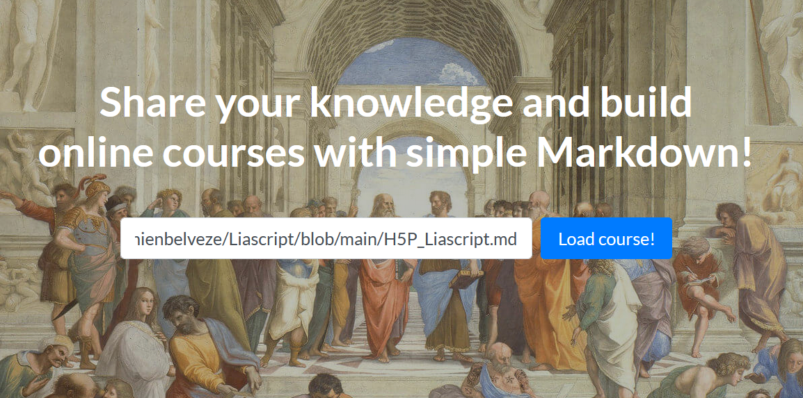
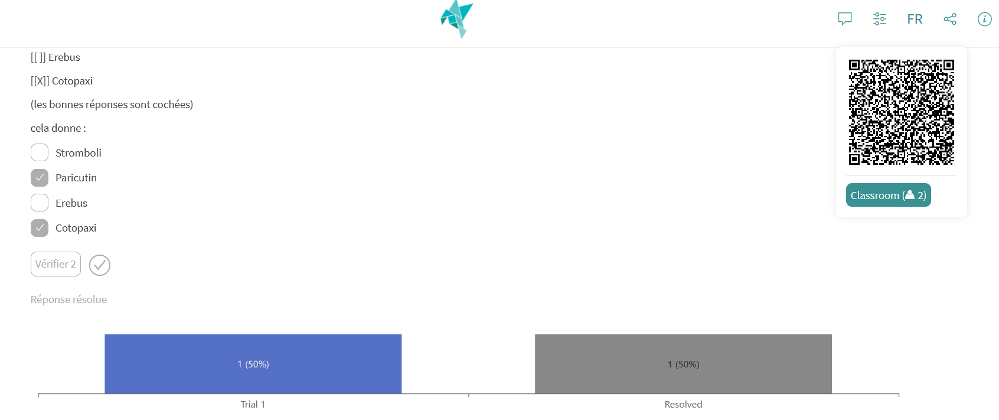

<!--

title: "Ecrire des ressources éducatives libres avec LiaScript"

email: damien.belveze@univ-rennes.fr 

language: fr 

@Jonas: French Male

comment: ce support a été présenté dans le cadre du Stretching Numérique le 26 mars 2025

script:   https://unpkg.com/mermaid@9.1.1/dist/mermaid.min.js

@mermaid
<script run-once="true" modify="false">
mermaid.initialize({});

var svg = mermaid.render('io9wuwzxt',`@0`.replace(/\\n/g, "\n"),
function(g) {
    return true;
})

"HTML: " + svg
</script>
@end


@mermaid_eval
<script>
mermaid.initialize({});
var graphDefinition = `@input`
var cb = function(svgGraph) {
    return true;
}

var svg = mermaid.render('io9wuwzxt',graphDefinition,cb)
console.html(svg)
"LIA: stop"
</script>
@end

import: https://raw.githubusercontent.com/LiaTemplates/citations/main/README.md

@onload
// this shall load an entire file at starttime that can be referenced
setTimeout(() => { window.bibliographyLoad("https://raw.githubusercontent.com/LiaTemplates/citations/main/bibtex.bib")}, 100)
@end

@red: <b style="color: red"> @0</b>

-->

# Utiliser LiasScript pour rédiger des ressources éducatives libres

](https://liascript.github.io/course/?https://raw.githubusercontent.com/damienbelveze/Liascript/main/Liascript.md#1)

*26 mars 2025*

CC:by 4.0 Damien Belvèze

<!--width="30%"-->


## 1. Introduction à LiaScript

### 1.1 LiaScript, un projet qui s'insère dans le mouvement des Ressources Educatives Libres (REL)

LiaScript est un @red(logiciel libre qui s'inscrit dans le mouvement des OER) (*Open Educational Resources*), ou REL (*Ressources éducatives Libres*) en français. Liascript interprête un texte en markdown directement dans le navigateur de la personne qui le lit. 


              --{{2 @Jonas}}--
L'idée est de permettre à n'importe qui de créer *un cours en ligne partageable seulement avec un éditeur de texte et un navigateur*. 
Liascript interprête le texte pour qu'il s'affiche sous la forme de cours interactif dans le navigateur de la personne qui le consulte. Le cours peut-être aisément téléchargé et modifié par tous. Il n'est pas nécessaire pour écrire et mettre à jour un support de formation réalisé avec Liascript d'utiliser d'autres outls que le compilateur LiaScript, il n'est pas nécessaire non plus d'intervenir sur un serveur. 

              --{{3 @Jonas}}--
A partir d'un support unique, Liascript permet différents types de présentation : diaporama, ouvrage, texte vocalisé.
LiaScript a été présenté par André Dietrich en [novembre 2019 à la conférence ELM Europe](https://youtu.be/w_CRABsJNKA), à la fois comme une alternative valable à Moodle et un outil complémentaire (et compatible avec les principaux LMS dont Moodle)

Le texte de la conférence est disponible en ligne [^3]

```bibtex @cite
@book{dietrichLiaScriptDomainspecificlanguageInteractive2019,
	title = {{LiaScript}: a domain-specific-language for interactive online courses},
	shorttitle = {{LiaScript}},
	url = {https://eric.ed.gov/?id=ED621589},
	abstract = {LiaScript is an attempt to enable everyone to create free and interactive online courses, without the need of being an experienced programmer. Instead, it aims to bring both parties, software- and course-developers, closer together by introducing Open-Source techniques into the Open-courSe development process. LiaScript was designed to be compatible to Common-Markdown, but it introduces lots of language extensions that deal with quizzes, surveys, ASCII-art, text2speech, animations, online programming, the integration of JavaScript, etc. as well as its own macro-system that simplifies tedious and repetitive tasks. It comes along with its own just-in-time compiler that runs in the browser and therefor does not require additional tooling. [For the full proceedings, see ED621557.]},
	language = {en},
	urldate = {2025-03-21},
	institution = {International Association for the Development of the Information Society},
	author = {Dietrich, André},
	year = {2019},
	note = {Publication Title: International Association for Development of the Information Society
ERIC Number: ED621589},
	keywords = {LiaScript, REL},
	file = {Dietrich - 2019 - LiaScript a domain-specific-language for interactive online courses.pdf:/home/dbelveze/OneDrive/Zotero/Obsidian/Dietrich - 2019 - LiaScript a domain-specific-language for interactive online courses.pdf:application/pdf},
}
```


### 1.2 Editer un texte pour l'interpréteur Liascript

              --{{2 @Jonas}}--
LiaScript interprête des textes en Markdown. La syntaxe de base de Markdown est très rapide à maîtriser.
Cet interpréteur a été pensé au départ pour des cours en informatique, il est donc possible d'exécuter du code à travers LiaScript. 

```javascript
var s = "Hello ";
alert(s)
s + "world";
```
<script>@input</script>


# 2. Où éditer en LiaScript ? 

- éditeur en local : VSCode, VScode web (pas encore dispo pour Codium, version libre de VSCode)
- [éditeur en ligne](https://liascript.github.io/LiveEditor) (ressemble à codIMD) : 


### 2.1 Utiliser l'éditeur en ligne de LiaScript  

Si pour tester la solution, vous reculez devant le fait de télécharger et de paramétrer un outil que vous ne connaissez pas, vous pouvez utiliser l'éditeur en [ligne de LiaScript](https://liascript.github.io/LiveEditor/)
Cliquer sur *New note*

[Démonstration avec des exemples](https://gist.github.com/damienbelveze/0468f5e90b11d95b11f89862b34a6dfa)


### 2.2 Editer avec VSCode 


Liascript est compatible originellement avec Atom et VS Code. Il a été ensuite adapté avec l'éditeur en ligne CodIMD [^3].

Télécharger Visual Studio Code si ce n'est pas déjà fait. 

Il faut ajouter deux extensions à VS Code : 

- LiaScript-preview

- Liascript-Snippet

Lorsqu'on a téléchargé LiaScript, il reste à modifier un paramétrage qui permettra d'activer l'extension LiaScript-Snippet

Dans VS Code faire la combinaison de touches "Ctrl-Shift-P" et entrer settings.
Dans le menu sélectionner **Préférences:Open user settings.json**

Ajouter au fichier le code suivant : 

````javascript
   "[markdown]": {
      "editor.tabCompletion": "on",
      "editor.quickSuggestions": true,
      "editor.snippetSuggestions": "top"
   },
````
Dès lors que ces extensions sont chargées et paramétrées, les menus lias devraient être accessibles


On peut commencer à éditer un cours dans VS code. 
Veiller à ce que Liascript identifie bien votre espace de travail : dans la colonne de gauche (explorer), faire un clic droit, sélectionner "Add Folder to workspace" et sélectionner le dossier qui contient le fichier en markdown que vous êtes en train d'éditer. 

**pour afficher la vue de votre texte interprété par LiaScript, faites la combinaison de touches ALT + L**

A partir de là, chaque fois que vous sauvegarderez votre texte (CTRL + S), la vue LiaScript devrait se mettre à jour automatiquement. Sinon, vous pouvez pousser la mise à jour en refaisant @red(ALT + L)

[^3]: Le texte de la conférence est disponible en ligne :  A. Dietrich, « LIASCRIPT: A DOMAIN-SPECIFIC-LANGUAGE FOR INTERACTIVE ONLINE COURSES », in Proceedings of the International Conference on e-Learning 2019, juill. 2019, p. 186‑194. doi: 10.33965/el2019_201909F024.

### 2.3 Commencer un cours  

Pour être parsé correctement, un texte conçu pour LiaScript doit commencer par un titre 1, soit en markdown, un \# suivi d'une espace et du titre du cours. 

Avant ce titre 1, vous pouvez ajouter des métadonnées afin de décrire votre ressource ou d'orienter le traitement des informations. 
Cela se fait sous la forme d'un commentaire initial 

````html
<!-- 
commentaire 1
commentaire 2 
-->
````

### 2.4 Créer des quiz avec LiaScript 

#### 2.4.1 Questions à choix multiples

Pour créer un QCM, sélectionner Lia-quiz-multiple-choice :

Lesquels de ces volcans se trouvent en Amérique ?

\[[ ]] Stromboli  

\[[X]] Paricutin

\[[ ]] Erebus 

\[[X]] Cotopaxi 

(les bonnes réponses sont cochées)

cela donne :

[[ ]] Stromboli
[[X]] Paricutin
[[ ]] Erebus
[[X]] Cotopaxi

Pour ajouter des indices

\[[ ]] Stromboli

\[[X]] Paricutin

\[[ ]] Erebus

\[[X]] Cotopaxi

\[[?]] Cotopaxi signifie "le cou de la lune" en quechua

\[[?]] Stromboli est un film italien


[[ ]] Stromboli
[[X]] Paricutin
[[ ]] Erebus
[[X]] Cotopaxi
[[?]] Cotopaxi signifie "le cou de la lune" en quechua
[[?]] Stromboli est un film italien

[^3]: CodIMD permet de rédiger du texte en markdown en mode collaboratif. le CNRS a ouvert une instance à tous les établissements universitaires de France : https://codimd.math.cnrs.fr/


\[[ ]] Stromboli

\[[X]] Paricutin

\[[ ]] Erebus

\[[X]] Cotopaxi

\[[?]] Cotopaxi signifie "le cou de la lune" en quechua

\[[?]] Stromboli est un film italien

\****************************************

Le Paricutin est l'un des volcans les plus récemment apparus sur Terre, il est né au Mexique en 1943
Le volcan Cotopaxi se trouve en Equateur.

\****************************************

cela donne une fois interprété (parsé)

[[ ]] Stromboli
[[X]] Paricutin
[[ ]] Erebus
[[X]] Cotopaxi
[[?]] Cotopaxi signifie "le cou de la lune" en quechua
[[?]] Stromboli est un film italien
****************************************

- Le Paricutin est l'un des volcans les plus récemment apparus sur Terre, il est né au Mexique en 1943
- Le volcan Cotopaxi se trouve en Equateur.

****************************************

#### 2.4.2 textes à trous

En 1610, rue de la Ferronnerie, un homme a poignardé à mort le roi Henri IV, quel était le nom de l'assassin ? 

[[Ravaillac]]

### 2.5 Intégrer d'autres langages dans Liascript 

```text
gantt
section Section
Completed :done,    des1, 2014-01-06,2014-01-08
Active        :active,  des2, 2014-01-07, 3d
Parallel 1   :         des3, after des1, 1d
Parallel 2   :         des4, after des1, 1d
Parallel 3   :         des5, after des3, 1d
Parallel 4   :         des6, after des4, 1d
```
@mermaid_eval

## 3. Partager un cours édité avec Liascript 

Lorsqu'on a rédigé un cours sur son éditeur de texte, on peut ensuite l'envoyer sur Github pour le rendre disponible. 

Afin qu'il soit interprété (que le texte en markdown soit transformé en texte lisible et interactif pour l'usager), il convient d'aller sur le site 
de Liascript et d'entrer l'URL du cours tel que disponible sur Github ou un autre espace de dépôt.



cliquer ensuite sur Load Course. 
On obtient ainsi [une URL](https://liascript.github.io/course/?https://raw.githubusercontent.com/damienbelveze/Liascript/main/H5P_Liascript.md#1) qui permet d'afficher sur n'importe quel navigateur le cours dans sa forme finale.

Si on souhaite que cette URL soit disponible et visible sur le dépôt Github, on peut le signaler avec un bouton cliquable 
Pour générer ce bouton, placer le code ci-dessous immédiatement après le titre (dièze d'introduction)

````markdown
[](https://LiaScript.github.io/course/?URL_du_cours)
`````
### 3.1 Importer un cours Liascript dans Moodle 

Cette opération peut se faire avec d'autres LMS (Canvas...), nous allons nous intéresser ici uniquement au cas de Moodle. 

Cette export vers Moodle est possible grâce à un programme complémentaire de Liascript : **Liascript-Exporter** (téléchargeable depuis Github) et grâce au protocole SCORM (la version 1.2 de SCORM est compatible avec Moodle 3.9- et les versions suivantes)

Pour installer Liascript-Exporter il faut disposer du logiciel npm sur sa machine. 

Une fois installé ce programme, on peut réaliser l'import du cours dans Moodle de la manière suivante : 

!?[](https://youtu.be/yk4uEqoKcpw)

### 3.2 Utiliser Liascript au cours d'une séance en synchrone. 

On peut utiliser des activités rédigées avec Liascript lors d'un cours avec des apprenants connectés. 
A une question donnée, on pourra voir dans quelles proportions la classe choisit l'une ou l'autre des réponses proposées.

Pour activer ce mode, aller en haut à droite sur l'icone "réseau", cela fait apparaître un QRcode. Sous le QRcode, cliquer sur classroom. 
Choisir un serveur (par exemple *Gun*)
A ce moment copier-coller l'URL de la page et l'envoyer à vos étudiants par messagerie (sur Zoom par exemple)
Demander aux apprenants de se connecter en cliquant sur le bouton connect (on peut éventuellement leur demander d'entrer un mot de passe qu'on a partagé préalablement avec eux pour accéder à ce cours).

Sous le QRcode s'affiche le nombre de personnes actuellement connectées. 

A partir de ce moment, chaque fois qu'un participant clique sur le bouton "check" (pour afficher la réponse), il verra s'afficher les réponses données par les autres apprenants à cette même question. 



# Références

@[bibliography.link](https://github.com/damienbelveze/Liascript/blob/main/biblio.bib)